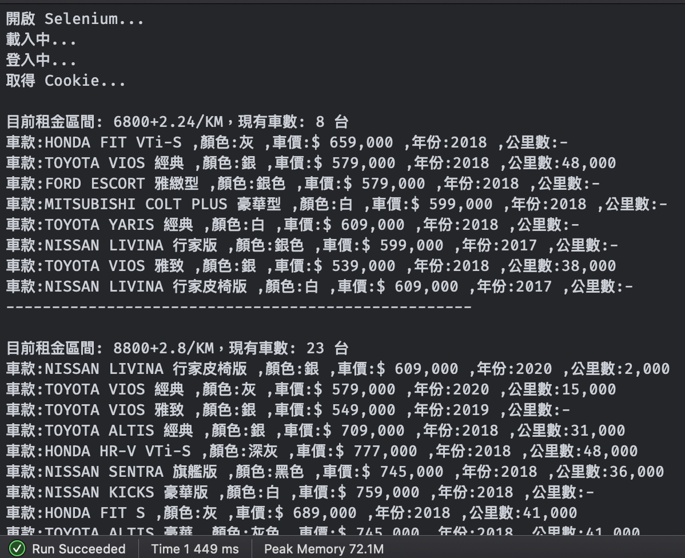

# Find My Dream Car

## Sealand 平台

### 用途

官網一頁一頁搜尋實在是有夠累，一鍵搜出喜歡的車

### 規格與參數說明

* Python3 + Selenium + Chrome

請記得使用自己的帳號密碼登入。  

`rent_price` 對應的是各方案，預設已經把中古車源的對應都放上去了  
如果想查全新車的車源，請自己把想查方案網址 `https://sealand.tw/temp/` 後面的純數字放進去就可以了  

* 至於城市代碼
    * 北部(宜蘭、花蓮、雙北、新竹、桃園)為 `8`
    * 中部(台中、嘉義)為 `11`
    * 南部(高雄、屏東)為 `14`


### 效果




## 格上平台

### 用途

官網詳細資料都要點進去看，一鍵搜出喜歡的車

### 規格與參數說明

* jq


```
curl -s https://gateway.api.car-plus.com.tw/common/srental/v1/car/subscribeInfos\?carState\=OLD\&orderBy\=MONTH_FEE\&page\=1\&size\=999\&sort\=ASC | jq '.data.page.list' | jq 'map(. + {Car : (.locationGeoRegionName +" "+ .mfgYear +" 年 " + .carBrand.brandName + " " + .carModel.carModelName + " " + .colorDesc + ", 車號：" + .plateNo + ", 租金：" + (.subscribeLevel.monthlyFee|tostring) + ", 行駛里程：" + (.currentMileage|tostring) )} | del(.carNo, .plateNo, .locationGeoRegion, .locationGeoRegionName, .carBrand, .carImages, .subscribeLevel, .carModel, .displacement, .mfgYear, .gearType, .fuelType, .colorDesc, .currentMileage, .equipIds, .tagIds, .carState))' | jq '.[].Car'
```

```
curl -s https://gateway.api.car-plus.com.tw/common/srental/v1/car/subscribeInfos\?carState\=NEW\&orderBy\=MONTH_FEE\&page\=1\&size\=999\&sort\=ASC | jq '.data.page.list' | jq 'map(. + {Car : (.locationGeoRegionName +" "+ .mfgYear +" 年 " + .carBrand.brandName + " " + .carModel.carModelName + " " + .colorDesc + ", 車號：" + .plateNo + ", 租金：" + (.subscribeLevel.monthlyFee|tostring) + ", 行駛里程：" + (.currentMileage|tostring) )} | del(.carNo, .plateNo, .locationGeoRegion, .locationGeoRegionName, .carBrand, .carImages, .subscribeLevel, .carModel, .displacement, .mfgYear, .gearType, .fuelType, .colorDesc, .currentMileage, .equipIds, .tagIds, .carState))' | jq '.[].Car'
```


```
"北區 2018 年 豐田 NEW VIOS 1.5 灰, 車號：RBX-2073, 租金：6800, 行駛里程：96119"
"南區 2019 年 三菱 Grand Lancer 1.8 灰, 車號：RCL-5029, 租金：6800, 行駛里程：52260"
"南區 2019 年 三菱 Grand Lancer 1.8 灰, 車號：RCL-5052, 租金：6800, 行駛里程：61838"
"南區 2019 年 三菱 Grand Lancer 1.8 銀, 車號：RCM-3653, 租金：6800, 行駛里程：55121"
"中區 2019 年 三菱 Grand Lancer 1.8 銀, 車號：RCM-3662, 租金：6800, 行駛里程：51830"
"中區 2019 年 三菱 Grand Lancer 1.8 銀, 車號：RCN-0067, 租金：6800, 行駛里程：72284"
"中區 2019 年 三菱 Grand Lancer 1.8 黑, 車號：RCN-0580, 租金：6800, 行駛里程：67386"
"北區 2017 年 豐田 NEW VIOS 1.5 灰, 車號：RDC-7923, 租金：6800, 行駛里程：1"
"北區 2018 年 豐田 YARIS 1.5 銀, 車號：RDJ-6132, 租金：6800, 行駛里程：1"
"南區 2018 年 納智捷 U5 1.6 白/黑, 車號：RAG-2913, 租金：8800, 行駛里程：29404"
"中區 2018 年 本田 HR-V 1.8 深灰, 車號：RCD-8297, 租金：8800, 行駛里程：95476"
"北區 2018 年 豐田 YARIS 1.5 白, 車號：RCE-3272, 租金：8800, 行駛里程：1"
"中區 2018 年 豐田 YARIS 1.5 白, 車號：RCE-3283, 租金：8800, 行駛里程：1"
"北區 2017 年 三菱 菱利-廂式 1.3 紅, 車號：RCF-8893, 租金：8800, 行駛里程：59100"
"北區 2019 年 納智捷 S5 GT 1.8 白, 車號：RCM-6097, 租金：8800, 行駛里程：33392"
"中區 2019 年 豐田 VIOS 1.5 銀, 車號：RCM-8510, 租金：8800, 行駛里程：1"
"中區 2019 年 日產 SENTRA 1.8 黑, 車號：RCN-2296, 租金：8800, 行駛里程：1"
"東區 2019 年 日產 SENTRA 1.8 白, 車號：RCN-2307, 租金：8800, 行駛里程：1"
"北區 2019 年 豐田 YARIS 1.5 灰, 車號：RCN-8860, 租金：8800, 行駛里程：1"
"北區 2019 年 納智捷 S5 GT 1.8 銀, 車號：RCQ-8720, 租金：8800, 行駛里程：63599"
"中區 2019 年 三菱 COLT PLUS 1.5 灰, 車號：RCR-1151, 租金：8800, 行駛里程：1"
"中區 2020 年 日產 I TIIDA 1.6 灰, 車號：RCW-6173, 租金：8800, 行駛里程：47833"
"北區 2020 年 日產 I TIIDA 1.6 藍, 車號：RCW-6183, 租金：8800, 行駛里程：46293"
"中區 2018 年 納智捷 U6 1.8 灰, 車號：RCX-8713, 租金：8800, 行駛里程：64887"
"北區 2020 年 日產 I TIIDA 1.6 銀, 車號：RDA-0390, 租金：8800, 行駛里程：42988"
"南區 2020 年 三菱 COLT PLUS 1.5 灰, 車號：RDA-5915, 租金：8800, 行駛里程：49708"
"南區 2020 年 三菱 COLT PLUS 1.5 灰, 車號：RDA-5922, 租金：8800, 行駛里程：47108"
"中區 2021 年 本田 FIT 1.5 白, 車號：RDC-5510, 租金：8800, 行駛里程：29057"
"北區 2018 年 豐田 ALTIS 1.8 銀, 車號：RDK-8675, 租金：8800, 行駛里程：1"
"北區 2018 年 日產 SUPER SENTRA 1.8 黑色, 車號：RDQ-7019, 租金：8800, 行駛里程：51064"
"北區 2019 年 日產 KICKS 1.5 白色, 車號：RCN-8113, 租金：10800, 行駛里程：1"
"北區 2020 年 日產 SENTRA 1.6 黑/橙黃, 車號：RCQ-8991, 租金：10800, 行駛里程：15276"
"北區 2020 年 納智捷 URX 1.8 銀, 車號：RCU-1963, 租金：10800, 行駛里程：47315"
"北區 2020 年 納智捷 URX 1.8 灰, 車號：RCW-1781, 租金：10800, 行駛里程：29234"
"中區 2020 年 豐田 ALTIS 1.8 白, 車號：RCW-3718, 租金：10800, 行駛里程：1"
"中區 2020 年 納智捷 URX 1.8 銀, 車號：RCW-7872, 租金：10800, 行駛里程：46851"
"中區 2020 年 日產 NEW SENTRA 1.6 灰, 車號：RCY-8715, 租金：10800, 行駛里程：44446"
"北區 2018 年 本田 HR-V 1.8 白色, 車號：RDH-3501, 租金：10800, 行駛里程：1"
"北區 2019 年 納智捷 U6 GT 1.8 黑, 車號：RDK-1820, 租金：10800, 行駛里程：22623"
"中區 2018 年 本田 HR-V 1.8 白, 車號：RDN-3565, 租金：10800, 行駛里程：114783"
"北區 2018 年 福特 KUGA 2.0 棕, 車號：RBK-1192, 租金：12800, 行駛里程：79818"
"北區 2018 年 納智捷 M7 2.2 灰, 車號：RBW-5183, 租金：12800, 行駛里程：80972"
"南區 2018 年 納智捷 M7 2.2 黑色, 車號：RBY-0072, 租金：12800, 行駛里程：53270"
"北區 2017 年 現代 Starex 2.5* 銀, 車號：RCB-0153, 租金：12800, 行駛里程：87422"
"中區 2017 年 現代 Starex 2.5* 銀, 車號：RCB-0162, 租金：12800, 行駛里程：80356"
"南區 2017 年 現代 Starex 2.5* 銀, 車號：RCB-0167, 租金：12800, 行駛里程：94339"
"南區 2017 年 現代 Starex 2.5* 銀, 車號：RCB-0232, 租金：12800, 行駛里程：88848"
"中區 2017 年 現代 Starex 2.5* 銀, 車號：RCB-0251, 租金：12800, 行駛里程：94407"
"北區 2017 年 本田 CR-V 2.0/2.4 白色, 車號：RCZ-8076, 租金：12800, 行駛里程：55849"
"北區 2018 年 豐田 CAMRY 2.0 銀, 車號：RDN-3876, 租金：12800, 行駛里程：80143"
"北區 2017 年 現代 Starex 2.5* 銀, 車號：RCB-0183, 租金：14800, 行駛里程：66103"
"中區 2019 年 納智捷 M7 2.2 灰色, 車號：RCQ-8721, 租金：14800, 行駛里程：46648"
"北區 2019 年 納智捷 M7 2.2 灰色, 車號：RCQ-8801, 租金：14800, 行駛里程：112153"
"中區 2017 年 日產 TEANA 2.5 深灰, 車號：RCT-9918, 租金：14800, 行駛里程：1"
```
